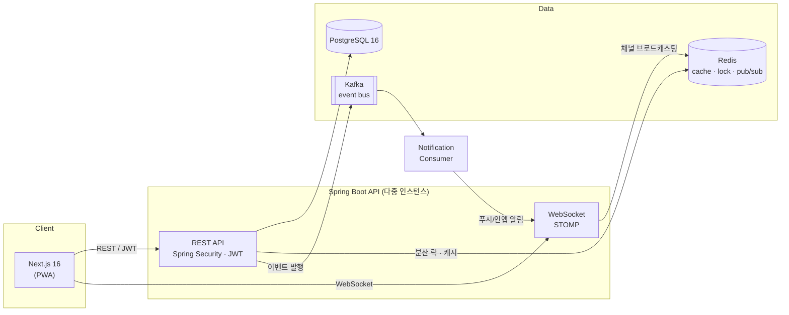
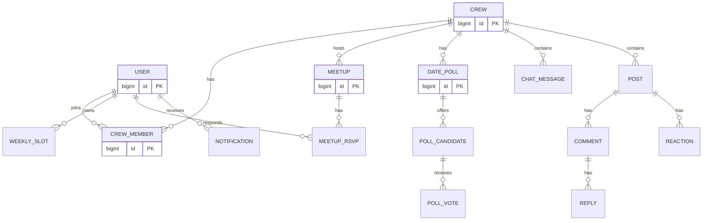

# 📅 Crew Schedule — 우리끼리 스케줄

> 친구·동료의 근무/휴무 스케줄을 한눈에 모아, **다 같이 만날 수 있는 시간을 자동으로 찾아주고**,
> 번개 모임을 선착순으로 잡고, 실시간으로 소통하는 그룹 스케줄링 플랫폼.

<p>
  
  
  
  
  
  
  
</p>

🔗 **데모**: _배포 후 링크_ · 📖 **API 문서(Swagger)**: `/swagger-ui.html` · 📝 **개발 계획서**: [`docs/DEVELOPMENT.md`](docs/DEVELOPMENT.md) · 📎 **기획서(PRD)**: [`docs/manyfast-기능명세서.md`](docs/manyfast-기능명세서.md)

---

## 📌 프로젝트 소개

여러 사람이 각자 다른 근무/휴무 스케줄을 가질 때 **"언제 다 같이 볼 수 있지?"** 를 매번 손으로 맞춰보는 건 번거롭습니다.
Crew Schedule은 각자의 주간 스케줄을 등록하면 **겹치는 빈 시간을 자동으로 계산**해 알려주고, 그 자리에서 번개 모임을 잡고
후보 날짜를 투표로 확정하며, 그룹 채팅으로 소통까지 이어지도록 만든 서비스입니다.

이 저장소는 개인 프로젝트로 시작한 [초기 바닐라 JS + Firebase 버전](docs/legacy/README.firebase.md)을
**Spring Boot 백엔드 + Next.js 프론트엔드**로 전면 재설계하면서, 실무에서 마주치는
**동시성 제어 · 실시간 통신 · 이벤트 기반 아키텍처 · 대용량 트래픽 처리**를 학습·적용하는 것을 목표로 합니다.

---

## ✨ 핵심 기능

| 기능 | 설명 |
|------|------|
| 🗓️ **주간 스케줄 관리** | 요일별 근무/휴무·시작·종료 시간 등록, 크루 단위 공유 |
| 🔍 **공통 가용시간 자동 계산** | 선택한 멤버들의 근무시간을 빼고 **겹치는 빈 시간대**를 요일별로 계산 (구간 교집합 알고리즘) |
| ⚡ **선착순 번개 모임** | 정원 제한 모임에 다수가 동시 참가 신청 → **오버부킹 없이** 정원 관리 |
| 🗳️ **날짜 투표** | 여러 후보 날짜 중 투표로 약속일 확정 (동시 투표 정합성 보장) |
| ✅ **약속 & RSVP** | 확정된 약속의 참석 여부(참석/미정/불참) 실시간 집계 |
| 💬 **크루 실시간 채팅** | WebSocket 기반 그룹 채팅 (다중 서버 브로드캐스팅) |
| 📋 **그룹 게시판** | 건의·공지 게시판 (이모지 반응·댓글·대댓글) |
| 🔔 **실시간 알림** | 새 약속·참가·확정·투표 등 이벤트 기반 알림 (STOMP 개인 큐로 인앱 배달) |
| 👤 **인증·프로필** | 이메일 + 소셜 로그인(카카오/구글), JWT 회전, 프로필 관리 |
| 🛠️ **관리자 시스템** | 통계 대시보드, 유저 정지·권한, 신고 처리, 컨텐츠 숨김 |
| 🚚 **레거시 이관** | Firebase RTDB(초기 MVP)의 유저·글·모임·RSVP를 새 백엔드로 자동 이관하는 스크립트 |
| 📱 **PWA** | 홈 화면 설치·오프라인 앱 셸 (Web Push는 미구현, [`docs/LIMITATIONS.md`](docs/LIMITATIONS.md) 참고) |

---

## 🛠️ 기술 스택

### Backend
- **Java 21**, **Spring Boot 3.5**
- Spring Web (REST API), Spring Data JPA, **QueryDSL** 스캐폴딩
- **Spring Security + JWT** (access/refresh 회전, `AuthPrincipal` implements `Principal`)
- **OAuth2** 소셜 로그인 (카카오·구글, 인가코드 직접 교환 방식)
- **Spring WebSocket (STOMP)** — `/topic` 브로드캐스트 + `/queue` 개인 큐
- **Redis** — Pub/Sub 채팅 팬아웃, Redisson 분산 락, Lua DECR 원자 연산
- **Apache Kafka** — 도메인 이벤트 발행/구독 (`crew-schedule.notifications`)
- **PostgreSQL 16** + Flyway 8단계 마이그레이션 (`V1`~`V8`)
- Springdoc OpenAPI (Swagger) — `/swagger-ui.html`

### Frontend
- **Next.js 16 (App Router)**, **React 19**, **TypeScript**
- TanStack Query (서버 상태) · Zustand + persist (클라이언트 상태·세션)
- Tailwind CSS + 자체 컴포넌트 (shadcn/ui는 미도입)
- STOMP.js (실시간 채팅/알림), 자체 `sw.js` + `manifest.ts` (PWA)

### Infra & Test
- **Docker / Docker Compose** (PostgreSQL + Redis + Kafka 원클릭 구동)
- **JUnit 5 · Testcontainers · spring-security-test** (통합 테스트 위주)
- **k6** — Phase 4 락 전략 부하 비교
- Actuator + Prometheus endpoint (Grafana 대시보드는 미구성)
- CI/CD (GitHub Actions), Dockerfile은 아직 미구현

---

## 🏗️ 시스템 아키텍처



---

## 🗄️ 도메인 모델 (ERD)


> 전체 필드와 관계는 [`docs/DEVELOPMENT.md`](docs/DEVELOPMENT.md)에 정리.

---

## 🔥 기술적 도전 & 해결

이 프로젝트의 핵심은 **평범한 CRUD를 넘어, 실무형 문제를 도메인 안에서 풀어낸 것**입니다.

### 1. 선착순 번개 모임 — 동시성 제어
> **문제**: 정원 8명 모임에 수백 명이 동시에 참가 요청하면, 단순 `count 조회 → 저장` 방식은 오버부킹이 발생.

단계별로 해결책을 적용하고 **부하 테스트(k6)로 정합성·처리량을 비교**합니다.

| 접근 | 방식 | 트레이드오프 |
|------|------|-------------|
| ① 낙관적 락 | `@Version` + 재시도 | 충돌 많으면 재시도 비용 ↑ |
| ② 비관적 락 | `SELECT ... FOR UPDATE` | 정합성 확실, 처리량 ↓ |
| ③ 분산 락 | Redisson `RLock` | 다중 서버 환경 대응 |
| ④ Redis 원자 연산 | Lua 스크립트 / `DECR` | 최고 처리량, DB 부하 최소화 |

→ 각 방식의 **동시 요청 1만 건 시나리오** 결과를 그래프로 문서화.

### 2. 실시간 그룹 채팅 — 다중 서버 브로드캐스팅
> **문제**: WebSocket 세션이 인스턴스에 붙어 있어, 서버가 2대 이상이면 다른 서버 사용자에게 메시지가 안 감.

→ **Redis Pub/Sub**으로 인스턴스 간 메시지를 팬아웃, 어느 서버에 붙어도 동일 채팅방 구독.

### 3. 이벤트 기반 알림 — Kafka
> **문제**: "약속 생성 → 멤버 전원에게 알림" 을 동기로 처리하면 응답이 느려지고 결합도가 높아짐.

→ 도메인 이벤트를 **Kafka**로 발행, 알림 컨슈머가 비동기로 fan-out. 발송 실패는 재처리 큐로 분리.
전달은 **온라인이면 WebSocket(인앱), 백그라운드면 Web Push(VAPID)** 로 분기.

### 4. 공통 가용시간 계산 — 도메인 알고리즘
멤버별 근무시간을 빼서 만든 "빈 구간"들의 **교집합(interval intersection)** 을 계산해
1시간 이상 겹치는 시간대만 요일별로 추천. (초기 버전의 킬러 기능을 서버 도메인 서비스로 이관)

---

## 🚀 로컬 실행

```bash
# 1. 인프라(Postgres · Redis · Kafka) 원클릭 기동 — Redis/Kafka는 백엔드 auto-config가 필요로 함
docker compose -f infra/docker-compose.yml up -d

# 2. 백엔드
cd backend && ./gradlew bootRun

# 3. 프론트 (별도 터미널)
cd frontend && npm install && npm run dev
```

| 서비스 | 주소 |
|--------|------|
| 프론트엔드 | <http://localhost:3000> |
| 백엔드 REST | <http://localhost:8080> |
| Swagger UI | <http://localhost:8080/swagger-ui.html> |
| STOMP WebSocket | `ws://localhost:8080/ws` |

**첫 실행 시 필독**:
- [`docs/RUNNING.md`](docs/RUNNING.md) — 상세 실행 가이드 (환경변수, 관리자 승격, 테스트 실행, k6 부하, 트러블슈팅)
- [`docs/LIMITATIONS.md`](docs/LIMITATIONS.md) — 알려진 한계와 후속 작업

---

## 📁 프로젝트 구조

```
crew-schedule/
├── backend/                      # Spring Boot API (Java 21)
│   └── src/main/java/.../
│       ├── auth/                 # JWT · OAuth2 · RefreshToken
│       ├── user/                 # 유저 도메인 · 프로필
│       ├── crew/                 # 크루 · 멤버십 · 초대코드
│       ├── schedule/             # 주간 스케줄 · 공통 가용시간 계산
│       ├── meetup/               # 약속 · RSVP
│       │   └── concurrency/      # Phase 4 — 5가지 락 전략
│       ├── poll/                 # 날짜 투표
│       ├── chat/                 # STOMP + Redis Pub/Sub
│       ├── board/                # 게시판 · 댓글 · 이모지 반응
│       ├── notification/         # Kafka 알림 파이프라인
│       ├── admin/                # 관리자 · 신고 처리
│       └── common/               # 공통(예외·응답·설정)
├── frontend/                     # Next.js 16 (App Router)
│   └── src/
│       ├── app/                  # 라우트: /login, /signup, /, /meetup, /poll,
│       │                         # /chat, /board, /edit, /admin
│       ├── components/           # UI 컴포넌트
│       └── lib/                  # API 클라이언트 · 훅 · Zustand 스토어
├── infra/
│   ├── docker-compose.yml        # Postgres + Redis + Kafka(KRaft)
│   └── k6/                       # Phase 4 부하 스크립트 + 시드
├── scripts/
│   └── migrate-firebase/         # 레거시 Firebase RTDB → 새 백엔드 이관
├── legacy/                       # 초기 MVP (바닐라 JS + Firebase, 보존용)
├── docs/                         # 실행 가이드 · Phase 4 상세 · 한계 정리
└── README.md
```

---

## 🗺️ 개발 로드맵

- [x] **Phase 0** — 프로젝트 세팅 (Gradle, Docker Compose, 프론트 스캐폴딩)
- [x] **Phase 1** — 인증 (JWT 회전 + 카카오/구글 OAuth2) + 프로필 + 크루/멤버십
- [x] **Phase 2** — 주간 스케줄 + 공통 가용시간 계산 (킬러 기능 복구)
- [x] **Phase 3** — 약속 · RSVP · 날짜 투표 (동시 투표 중복 방지)
- [x] **Phase 4** — 🔥 선착순 동시성 제어 (Naive/Optimistic/Pessimistic/Redisson/Redis Atomic) + k6
- [x] **Phase 5** — 실시간 채팅 (STOMP + Redis Pub/Sub 다중 인스턴스 팬아웃)
- [x] **Phase 6** — Kafka 이벤트 알림 + 게시판(이모지·댓글·대댓글)
- [x] **Phase 7** — 관리자 시스템 (대시보드 · 유저 정지/권한 · 신고 처리 · 컨텐츠 숨김)
- [x] **Phase 8** — 프론트 완결 (인증/스케줄/약속/투표/채팅/게시판/알림 벨/관리자) + PWA + Firebase 이관 스크립트
- [ ] **후속** — Web Push · Dockerfile · GitHub Actions · Grafana 대시보드 · E2E 테스트

각 Phase의 실제 커밋은 `git log --oneline` 참고. 현재 알려진 갭·미완결 항목은 [`docs/LIMITATIONS.md`](docs/LIMITATIONS.md).

## 📚 문서

- [`docs/RUNNING.md`](docs/RUNNING.md) — 로컬 실행 상세 가이드 + 트러블슈팅
- [`docs/LIMITATIONS.md`](docs/LIMITATIONS.md) — 알려진 한계 · 검증되지 않은 부분 · 후속 우선순위
- [`docs/phase4-concurrency.md`](docs/phase4-concurrency.md) — 선착순 락 4가지 전략 트레이드오프
- [`scripts/migrate-firebase/README.md`](scripts/migrate-firebase/README.md) — Firebase RTDB → 새 백엔드 이관

---

<sub>초기 버전(바닐라 JS + Firebase) MVP 코드는 [`legacy/`](legacy/)에, 문서는 [`docs/legacy/README.firebase.md`](docs/legacy/README.firebase.md)에 보존되어 있습니다.</sub>
